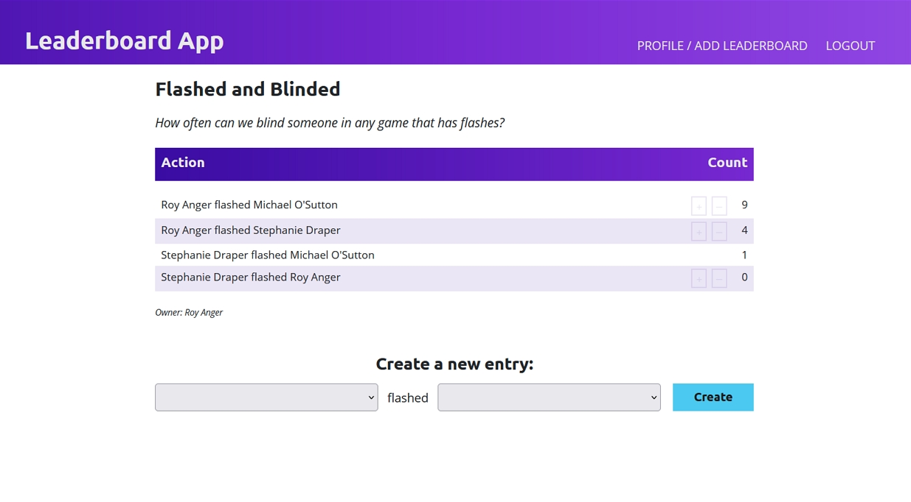

# Leaderboard App

A simple project combining React, GraphQL and FaunaDB to provide a fun leaderboard for friends who game together on a particular discord. This is just a fun, silly app and was a chance to work on something using GraphQL and FaunaDB and have a live app.

| Account Management                            | Leaderboard                     |
| --------------------------------------------- | ------------------------------- |
|  |  |

## How does it work?

-  Auth is handled via Google Firebase
-  The DB is FaunaDB, and all queries and mutations are done through Graphql with the Apollo Client.
-  The frontend is a simple React app, with no SSG or SSR. Since all parts of the app are behind the login, there is no need for SEO for those pages.
-  No CSS or UI libraries were used -- everything is just plain CSS added through SCSS.

## Configuring Application

1. Rename `.env.sample` to `.env`
1. You will need to create a key to access your Faunadb Collection. This key should have full access to create, delete, edit on that Collection. Edit .env and add this key.
1. You will need to create a Firebase account and setup up Authentication. You can use whatever 3rd Party options you wish. There is nothing to handle email/password at this time. Edit `.env` to add the values to your application.
1. Edit `.env` and change the `SITE_TITLE` to the name you want to use on your site.

## Local Development

`npm start`
Starts the app and lets you hot reload as your edit the project. Make sure you add `localhost` to the **Sign-in method** under Authenication on Firebase.

## Deploying

At this time, the site has only ever been deployed to Vercel and not tested on any other service.

To deploy to Vercel, follow these steps:

1. Create your project and link to the github repo you created for this leaderboard.
1. In the settings section of the project on Vercel, add the values from your `.env` values as **Envionment Variables**
1. Push your latest commit to github and let Vercel deploy.\_dialog_overlay
1. You will need to either use your own domain (as the root domain or a subdomain) and add that to Firebase's Authenication under **Sign-in method** or you will need to add the random domain generated on each deployment to the same. Without adding this your app will error on the login page.
